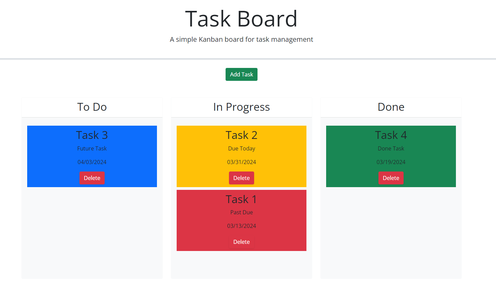
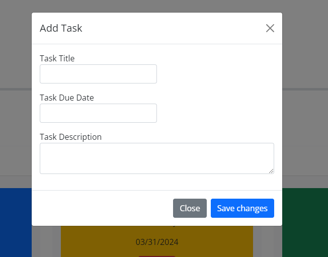

# Task Board
## Author: Thomas Stranick

## Description

The task board is a useful tool to create and organize tasks in a kanban format. The user can create tasks which are then displayed within the board to be moved around. The tasks display colors based on the date in which they are dues, as well as can be deleted. This project was beneficial in learning about jQuery and Bootstrap, which both were used extensively within the code. 

## Visuals

## Deployment

Provided as a link here - [Task Board](https://github.com/ThStranick15/task_board)

## Usage

To use the webpage, the user can start by adding a task to the board with the pop-up modal. They can enter the title, date (using day.js), and a description. Once they select save changes, the taks will appear in the To Do column. The user can make as many tasks as they'd like. All of thier attributes are stored in local storage so that on page reload they will appear again. Their color is indicitive of their due date, red being past due, yellow being due today, blue being not due yet, and green being completed. They can then be dragged and dropped into the other status columns, where they will stay after page refresh. Each of the tasks can also be deleted using the button provided on each task, which will delete them from the board and storage.

## Credits

- Bootstrap - modal and css classes
- Jquery - various function references
- JD (Bootcamp Instructor) - demonstration on drag & drop functionality

## License

Please refer to the LICENSE in the repo.